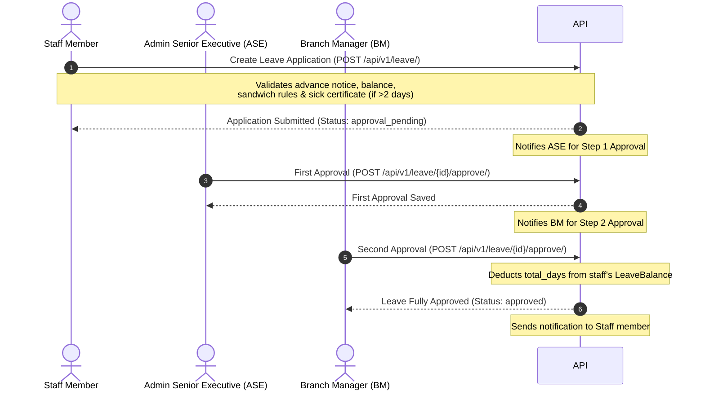

# Leave Management System — API Documentation

This document describes the API endpoints, schemas, request payloads, response bodies, and the step-by-step workflow for the **Leave Management System**.

---

## Table of Contents
1. [Introduction & Auth Requirements](#1-introduction--auth-requirements)
2. [Workflow Overview (Step-by-Step)](#2-workflow-overview-step-by-step)
3. [Leave Policies APIs](#3-leave-policies-apis)
4. [Public Holidays APIs](#4-public-holidays-apis)
5. [Leave Balance APIs](#5-leave-balance-apis)
6. [Leave Application APIs](#6-leave-application-apis)
7. [Approval / Rejection Workflow APIs](#7-approval--rejection-workflow-apis)
8. [Late Entry Tracking APIs](#8-late-entry-tracking-apis)

---

## 1. Introduction & Auth Requirements

- **Base URL**: `/api/v1/`
- **Authentication**: All APIs require a valid JWT token passed in the `Authorization` header:
  `Authorization: Bearer <your_access_token>`
- **Roles in the System**:
  - `super_admin`: Full system access across all organizations and branches.
  - `branch_manager`: Admin access restricted to their own branch (or organization wide depending on system settings).
  - `admin_senior_executive` (ASE): Multi-step approval and general administrative viewing capabilities.
  - `faculty`, `front_desk`, `counsellor`, etc.: Staff users who can request leaves, view their balances, and view their own late entries.
  - `student`, `parents`, `accountant`: Restricted from applying for leaves or accessing administrative functions.
- **Branch Context (`branch_id`)**: Many POST endpoints accept an optional `branch_id`. If omitted, the system automatically infers it from the logged-in user's profile or the target user's profile. However, if a `super_admin` makes the request, they must explicitly pass `branch_id` since they do not belong to a specific branch.

---

## 2. Workflow Overview (Step-by-Step)



1. **Setup Policies & Holidays**: Admin creates Public Holidays and Leave Policies for a branch.
2. **Initialize Balances**: System/Admin initializes the annual leave quota for all staff.
3. **Submit Application**: Staff applies for leave. The system computes the total days applying sandwich and weekday rules.
4. **Step 1 Approval**: Admin Senior Executive approves the leave request (First Approver).
5. **Step 2 Approval**: Branch Manager approves the leave request (Second Approver). The leave balance is automatically updated, and the status becomes `approved`.

---

## 3. Leave Policies APIs

Policies define leave constraints (annual quota, advance notice requirements, carry forward rules, half-day allowances, and sandwich rules) per branch and leave type.

### 3.1 Get All Leave Policies
* **Endpoint**: `GET /leave/policy/`
* **Access**: Authenticated users (filtered by branch/organization context).
* **Response**:
  ```json
  {
    "success": true,
    "data": [
      {
        "id": "e9b43e8d-80dc-4a6c-941e-62729d319b36",
        "branch": "dd4b150b-c817-497b-89bf-62729d319b36",
        "leave_type": "sick",
        "leave_type_display": "Sick Leave",
        "annual_quota": 10,
        "max_club_days": 5,
        "carry_forward": false,
        "max_carry_days": 0,
        "min_advance_days": 0,
        "allow_half_day": true,
        "sandwich_rule": false,
        "is_active": true
      },
      {
        "id": "f8a21d1b-80dc-4a6c-941e-62729d319b36",
        "branch": "dd4b150b-c817-497b-89bf-62729d319b36",
        "leave_type": "casual",
        "leave_type_display": "Casual Leave",
        "annual_quota": 12,
        "max_club_days": 3,
        "carry_forward": true,
        "max_carry_days": 4,
        "min_advance_days": 3,
        "allow_half_day": true,
        "sandwich_rule": true,
        "is_active": true
      }
    ]
  }
  ```

### 3.2 Get Leave Policy Details
* **Endpoint**: `GET /leave/policy/<policy_id>/`
* **Access**: Authenticated users (filtered by branch/organization context).
* **Response**: Same detailed JSON object as the `data` block in **3.3**.

### 3.3 Create or Update Leave Policy
* **Endpoint**: `POST /leave/policy/`
* **Access**: `super_admin`, `branch_manager`
* **Request Body**:
  > [!NOTE]
  > `branch_id` is automatically inferred for branch managers. It is **required** if the user is a `super_admin`.
  ```json
  {
    "leave_type": "casual",
    "annual_quota": 12,
    "max_club_days": 3,
    "min_advance_days": 3,
    "allow_half_day": true,
    "sandwich_rule": true,
    "carry_forward": true,
    "max_carry_days": 4,
    "branch_id": "dd4b150b-c817-497b-89bf-62729d319b36"
  }
  ```
* **Response**:
  ```json
  {
    "success": true,
    "message": "Policy created.",
    "data": {
      "id": "f8a21d1b-80dc-4a6c-941e-62729d319b36",
      "branch": "dd4b150b-c817-497b-89bf-62729d319b36",
      "leave_type": "casual",
      "leave_type_display": "Casual Leave",
      "annual_quota": 12,
      "max_club_days": 3,
      "carry_forward": true,
      "max_carry_days": 4,
      "min_advance_days": 3,
      "allow_half_day": true,
      "sandwich_rule": true,
      "is_active": true
    }
  }
  ```

### 3.4 Edit Leave Policy Details
* **Endpoint**: `PATCH /leave/policy/<policy_id>/`
* **Access**: `super_admin`, `branch_manager`
* **Request Body**:
  ```json
  {
    "annual_quota": 15,
    "min_advance_days": 2
  }
  ```
* **Response**:
  ```json
  {
    "success": true,
    "message": "Policy updated.",
    "data": {
      "id": "f8a21d1b-80dc-4a6c-941e-62729d319b36",
      "branch": "dd4b150b-c817-497b-89bf-62729d319b36",
      "leave_type": "casual",
      "leave_type_display": "Casual Leave",
      "annual_quota": 15,
      "max_club_days": 3,
      "carry_forward": true,
      "max_carry_days": 4,
      "min_advance_days": 2,
      "allow_half_day": true,
      "sandwich_rule": true,
      "is_active": true
    }
  }
  ```

### 3.5 Deactivate Leave Policy
* **Endpoint**: `DELETE /leave/policy/<policy_id>/`
* **Access**: `super_admin`, `branch_manager`
* **Response**:
  ```json
  {
    "success": true,
    "message": "Leave policy deactivated."
  }
  ```

---

## 4. Public Holidays APIs

Public holidays are used to calculate leave durations when sandwich policies are applied.

### 4.1 Get Public Holidays
* **Endpoint**: `GET /leave/public-holidays/`
* **Access**: Authenticated users.
* **Search & Filter Parameters**:
  - `year`: (integer, optional) Exact match filter by year (e.g., `?year=2026`).
  - `search`: (string, optional) Performs a text search on the `name` field (e.g., `?search=Diwali`).
  - `ordering`: (string, optional) Order the results by any field (e.g., `?ordering=date` or `?ordering=-date` for descending).
* **Response**:
  ```json
  {
    "success": true,
    "data": [
      {
        "id": "31b4028f-7c15-4c07-ba24-cf8c1e627f19",
        "branch": "dd4b150b-c817-497b-89bf-62729d319b36",
        "date": "2026-08-15",
        "name": "Independence Day",
        "year": 2026,
        "created_at": "2026-06-16T10:14:16+05:30"
      }
    ]
  }
  ```

### 4.2 Get Public Holiday Details
* **Endpoint**: `GET /leave/public-holidays/<holiday_id>/`
* **Access**: Authenticated users.
* **Response**: Same detailed JSON object as the `data` block in **4.3**.

### 4.3 Create Public Holiday
* **Endpoint**: `POST /leave/public-holidays/`
* **Access**: `super_admin`, `branch_manager`
* **Request Body**:
  > [!NOTE]
  > `branch_id` is automatically inferred for branch managers. It is **required** if the user is a `super_admin`.
  ```json
  {
    "date": "2026-10-02",
    "name": "Gandhi Jayanti",
    "branch_id": "dd4b150b-c817-497b-89bf-62729d319b36"
  }
  ```
* **Response**:
  ```json
  {
    "success": true,
    "message": "Public holiday created.",
    "data": {
      "id": "78fa1a8f-7c15-4c07-ba24-cf8c1e627f19",
      "branch": "dd4b150b-c817-497b-89bf-62729d319b36",
      "date": "2026-10-02",
      "name": "Gandhi Jayanti",
      "year": 2026,
      "created_at": "2026-06-16T10:35:00+05:30"
    }
  }
  ```

### 4.4 Update Public Holiday
* **Endpoint**: `PATCH /leave/public-holidays/<holiday_id>/`
* **Access**: `super_admin`, `branch_manager`
* **Request Body**:
  ```json
  {
    "name": "Gandhi Jayanti Observance",
    "date": "2026-10-03"
  }
  ```
* **Response**:
  ```json
  {
    "success": true,
    "message": "Holiday updated.",
    "data": {
      "id": "78fa1a8f-7c15-4c07-ba24-cf8c1e627f19",
      "branch": "dd4b150b-c817-497b-89bf-62729d319b36",
      "date": "2026-10-03",
      "name": "Gandhi Jayanti Observance",
      "year": 2026,
      "created_at": "2026-06-16T10:35:00+05:30"
    }
  }
  ```

### 4.5 Delete Public Holiday
* **Endpoint**: `DELETE /leave/public-holidays/<holiday_id>/`
* **Access**: `super_admin`, `branch_manager`
* **Response**:
  ```json
  {
    "success": true,
    "message": "Public holiday deleted."
  }
  ```

---

## 5. Leave Balance APIs

Tracks remaining leave days for users by year and leave type.

### 5.1 Get Current User Balances
* **Endpoint**: `GET /leave/balance/`
* **Access**: Authenticated staff users.
* **Response**:
  ```json
  {
    "success": true,
    "data": [
      {
        "id": "582b4a1b-12d8-4f81-ba5f-7ca5635c382e",
        "leave_type": "sick",
        "leave_type_display": "Sick Leave",
        "year": 2026,
        "total_days": "10.0",
        "used_days": "2.0",
        "carried_forward": "0.0",
        "remaining_days": "8.0"
      },
      {
        "id": "c9284da8-12d8-4f81-ba5f-7ca5635c382e",
        "leave_type": "casual",
        "leave_type_display": "Casual Leave",
        "year": 2026,
        "total_days": "12.0",
        "used_days": "0.0",
        "carried_forward": "2.0",
        "remaining_days": "14.0"
      }
    ]
  }
  ```

### 5.2 Get specific User Balances (Admin view)
* **Endpoint**: `GET /leave/balance/<user_id>/`
* **Access**: `super_admin`, `branch_manager`, `admin_senior_executive`
* **Query Parameters**:
  - `year`: (integer, optional) Filter by specific year (defaults to current year).
* **Response**: Same format as **5.1** but contains the specified user's balances.

---

## 6. Leave Application APIs

### 6.1 List Leave Applications
* **Endpoint**: `GET /leave/`
* **Access**: Authenticated users (Admins see all branch/org applications, normal staff see only their own).
* **Search & Filter Parameters**:
  - `status`: (string, optional) Exact match filter e.g., `approval_pending`, `approved`, `rejected`
  - `leave_type`: (string, optional) Exact match filter e.g., `paid`, `sick`, `casual`, `club`, `unpaid`
  - `applied_by`: (string, optional) User ID (accessible to admins only)
  - `from_date`: (string, optional) Inclusive start date filter (`YYYY-MM-DD`)
  - `to_date`: (string, optional) Inclusive end date filter (`YYYY-MM-DD`)
  - `search`: (string, optional) Performs a text search on the applicant's name (`applied_by__name`) and `reason` (e.g., `?search=John`).
  - `ordering`: (string, optional) Order the results by any field (e.g., `?ordering=-created_at`).
* **Response**:
  ```json
  {
    "success": true,
    "count": 1,
    "next": null,
    "previous": null,
    "page_size": 50,
    "data": [
      {
        "id": "a9d34b22-80dc-4a6c-941e-62729d319b36",
        "applied_by": "8ca5635c-ba5f-7ca5-8898-7ca5635c382e",
        "applied_by_name": "John Doe",
        "leave_type": "casual",
        "leave_type_display": "Casual Leave",
        "from_date": "2026-06-20",
        "to_date": "2026-06-22",
        "is_half_day": false,
        "total_days": "3.0",
        "status": "approval_pending",
        "status_display": "Approval Pending",
        "is_auto_generated": false,
        "supporting_document_url": null,
        "is_first_approval_done": false,
        "created_at": "2026-06-16T10:14:16+05:30"
      }
    ]
  }
  ```

### 6.2 Submit Leave Application
* **Endpoint**: `POST /leave/`
* **Access**: Authenticated Staff (Excludes: `student`, `parents`, `accountant`)
* **Content Type**: `multipart/form-data` (if uploading document) or `application/json`
* **Form/JSON Parameters**:
  - `leave_type`: (string, required) `paid`, `sick`, `casual`, `club`, `unpaid`
  - `from_date`: (string, required) `YYYY-MM-DD`
  - `to_date`: (string, required) `YYYY-MM-DD`
  - `is_half_day`: (boolean, optional) Default is `false`
  - `half_day_session`: (string, optional) `morning` or `afternoon` (Required if `is_half_day` is true)
  - `reason`: (string, required) Detailed reason for the leave
  - `supporting_document`: (file, optional) Required if `leave_type` is `sick` and total leave days exceed 2.
  - `branch_id`: (string, optional) Contextual branch identifier. Required only if the applicant is a `super_admin`.
* **Response (Success)**:
  ```json
  {
    "success": true,
    "message": "Leave application submitted.",
    "data": {
      "id": "a9d34b22-80dc-4a6c-941e-62729d319b36",
      "applied_by": "8ca5635c-ba5f-7ca5-8898-7ca5635c382e",
      "applied_by_name": "John Doe",
      "branch": "dd4b150b-c817-497b-89bf-62729d319b36",
      "leave_type": "casual",
      "leave_type_display": "Casual Leave",
      "from_date": "2026-06-20",
      "to_date": "2026-06-22",
      "is_half_day": false,
      "half_day_session": "",
      "total_days": "3.0",
      "reason": "Family function",
      "supporting_document": null,
      "supporting_document_url": null,
      "is_auto_generated": false,
      "status": "approval_pending",
      "status_display": "Approval Pending",
      "first_approver": null,
      "first_approver_name": "",
      "first_approved_at": null,
      "second_approver": null,
      "second_approver_name": "",
      "second_approved_at": null,
      "reviewed_by": null,
      "reviewed_at": null,
      "rejection_reason": "",
      "created_at": "2026-06-16T10:14:16+05:30"
    }
  }
  ```

### 6.3 Get Leave Application Details
* **Endpoint**: `GET /leave/<leave_id>/`
* **Access**: Applicant or Admins (`super_admin`, `branch_manager`, `admin_senior_executive`)
* **Response**: Same detailed JSON object as the `data` block in **6.2**.

### 6.4 Edit Pending Leave Application
* **Endpoint**: `PATCH /leave/<leave_id>/`
* **Access**: Only the applicant, and only if status is `approval_pending`.
* **Request Body**: (Allows updating details before approvals occur)
  ```json
  {
    "from_date": "2026-06-21",
    "to_date": "2026-06-22",
    "reason": "Rescheduled family function"
  }
  ```
* **Response**: Same detailed JSON object as the `data` block in **6.2** with updated values.

### 6.5 Cancel Leave Application
* **Endpoint**: `DELETE /leave/<leave_id>/`
* **Access**: Only the applicant, and only if status is `approval_pending`.
* **Response**:
  ```json
  {
    "success": true,
    "message": "Leave cancelled."
  }
  ```

---

## 7. Approval / Rejection Workflow APIs

This workflow follows multi-level approval mechanics. Step 1 must be completed by `admin_senior_executive`, followed by Step 2 by `branch_manager`. `super_admin` can complete both steps automatically.

### 7.1 Approve Leave Application
* **Endpoint**: `POST /leave/<leave_id>/approve/`
* **Access**: `admin_senior_executive`, `branch_manager`, `super_admin`
* **Response (ASE - Step 1 Approval)**:
  ```json
  {
    "success": true,
    "message": "First approval done. Awaiting branch manager."
  }
  ```
* **Response (Branch Manager / Super Admin - Full Approval)**:
  > [!NOTE]
  > This action automatically deducts the calculated leave days from the user's corresponding LeaveBalance record.
  ```json
  {
    "success": true,
    "message": "Leave approved."
  }
  ```

### 7.2 Reject Leave Application
* **Endpoint**: `POST /leave/<leave_id>/reject/`
* **Access**: `admin_senior_executive`, `branch_manager`, `super_admin`
* **Request Body**:
  ```json
  {
    "reason": "Heavy project workload during these dates."
  }
  ```
* **Response**:
  ```json
  {
    "success": true,
    "message": "Leave rejected."
  }
  ```

---

## 8. Late Entry Tracking APIs

Late entries are registered via automated QR code attendance scans or manual admin entry. Exceeding thresholds automatically prompts deduction rules.

### 8.1 List Late Entry Records
* **Endpoint**: `GET /leave/late-entries/`
* **Access**: Authenticated users (Admins see all branch/org entries, staff see only their own).
* **Search & Filter Parameters**:
  - `user` / `user_id`: (string, optional) Filter by user ID (accessible to admins only)
  - `is_penalized`: (boolean, optional) Filter by penalization status (`true`/`false`)
  - `penalty_type`: (string, optional) Exact match filter by penalty type (`half_day_deduction`, `salary_deduction`, `warning`)
  - `from_date`: (string, optional) Inclusive start date filter (`YYYY-MM-DD`)
  - `to_date`: (string, optional) Inclusive end date filter (`YYYY-MM-DD`)
  - `search`: (string, optional) Performs a text search on the user's name (`user__name`) and `notes` (e.g., `?search=Traffic`).
  - `ordering`: (string, optional) Order the results by any field (e.g., `?ordering=-date`).
* **Response**:
  ```json
  {
    "success": true,
    "count": 1,
    "next": null,
    "previous": null,
    "page_size": 50,
    "data": [
      {
        "id": "b9687e1a-80dc-4a6c-941e-62729d319b36",
        "user": "8ca5635c-ba5f-7ca5-8898-7ca5635c382e",
        "user_name": "John Doe",
        "date": "2026-06-15",
        "expected_time": "09:00:00",
        "actual_time": "09:25:00",
        "late_minutes": 25,
        "grace_minutes": 10,
        "is_penalized": true,
        "penalty_type": "salary_deduction",
        "penalty_type_display": "Salary Deduction",
        "auto_deduction_triggered": false,
        "notes": "Traffic jam delay",
        "created_at": "2026-06-15T09:25:00+05:30"
      }
    ]
  }
  ```

### 8.2 Get Late Entry Details
* **Endpoint**: `GET /leave/late-entries/<entry_id>/`
* **Access**: Authenticated users (Admins see all branch/org entries, staff see only their own).
* **Response**: Same detailed JSON object as the `data` block in **8.3**.

### 8.3 Create Late Entry Record (Manual Entry)
* **Endpoint**: `POST /leave/late-entries/`
* **Access**: `branch_manager`, `admin_senior_executive`, `super_admin`
* **Request Body**:
  > [!NOTE]
  > `branch_id` is optional. The system will fall back to inferring it from the target `user_id`'s profile if the logged-in user is a `super_admin`.
  ```json
  {
    "user_id": "8ca5635c-ba5f-7ca5-8898-7ca5635c382e",
    "date": "2026-06-16",
    "expected_time": "09:00:00",
    "actual_time": "09:22:00",
    "penalty_type": "warning",
    "notes": "Late check-in via reception",
    "branch_id": "dd4b150b-c817-497b-89bf-62729d319b36"
  }
  ```
* **Response**:
  > [!IMPORTANT]
  > Upon creation, the system checks whether the user's monthly late entries have reached the penalty threshold set in the branch's LateEntryPolicy. If reached and auto-deduction is enabled, a `0.5` casual or unpaid leave application is automatically created and approved.
  ```json
  {
    "success": true,
    "message": "Late entry recorded.",
    "data": {
      "id": "c71a39f9-80dc-4a6c-941e-62729d319b36",
      "user": "8ca5635c-ba5f-7ca5-8898-7ca5635c382e",
      "user_name": "John Doe",
      "date": "2026-06-16",
      "expected_time": "09:00:00",
      "actual_time": "09:22:00",
      "late_minutes": 22,
      "grace_minutes": 10,
      "is_penalized": true,
      "penalty_type": "warning",
      "penalty_type_display": "Warning",
      "auto_deduction_triggered": false,
      "notes": "Late check-in via reception",
      "created_at": "2026-06-16T10:35:00+05:30"
    }
  }
  ```

### 8.4 Update Late Entry Record
* **Endpoint**: `PATCH /leave/late-entries/<entry_id>/`
* **Access**: `branch_manager`, `admin_senior_executive`, `super_admin`
* **Request Body**:
  ```json
  {
    "is_penalized": false,
    "penalty_type": "",
    "notes": "Excused by manager due to official field visit"
  }
  ```
* **Response**: Same format as the data block in **8.2** with updated values.

### 8.5 Delete Late Entry Record
* **Endpoint**: `DELETE /leave/late-entries/<entry_id>/`
* **Access**: `branch_manager`, `admin_senior_executive`, `super_admin`
* **Response**:
  ```json
  {
    "success": true,
    "message": "Late entry deleted."
  }
  ```

---

## 9. Dropdowns, Choices & Role Privileges

Here is the complete reference of choices and dropdown options used within the Leave Management system:

### 9.1 Leave Types (`leave_type`)
Used in policies, balances, and applications.
| Value | Display Label | Description / Business Rules |
| :--- | :--- | :--- |
| `paid` | Paid Leave | Subject to advance notice. Deducted from paid balance. |
| `sick` | Sick Leave | Exempt from past-date and advance notice checks. Requires medical certificate upload if duration is > 2 days. |
| `casual` | Casual Leave | Deducted from casual balance. Primary fallback for auto-deductions. |
| `club` | Club Leave | Yearly maximum cap is enforced by the policy. |
| `unpaid` | Unpaid Leave | Used when leave balances are exhausted or when selected explicitly. |

### 9.2 Leave Status (`status`)
Maintained on leave applications.
| Value | Display Label | State Details |
| :--- | :--- | :--- |
| `approval_pending` | Approval Pending | Initial state. Can be edited/cancelled by the applicant. Awaiting approvals. |
| `approved` | Approved | Final approved state. Triggers balance deduction. |
| `rejected` | Rejected | Denied by an approver. Includes a rejection reason. |
| `cancelled` | Cancelled | Cancelled by the applicant prior to approval. |

### 9.3 Half Day Sessions (`half_day_session`)
Required if `is_half_day` is set to `true`.
- `morning`: Morning Session
- `afternoon`: Afternoon Session

### 9.4 Penalty Types (`penalty_type`)
Applied to late entry records.
- `half_day_deduction`: Triggers a 0.5 day leave deduction.
- `salary_deduction`: Triggers general payroll deduction logs.
- `warning`: Recorded as a warning message on the user profile.

### 9.5 Leave System Privilege Matrix
| Role | Apply Leave? | Policy CRUD? | Holiday CRUD? | Approval Level? | Late Entry Admin? |
| :--- | :---: | :---: | :---: | :---: | :---: |
| `super_admin` | No | Yes | Yes | Bypass both levels | Yes |
| `branch_manager` | No | Yes | Yes | Step 2 (Final) | Yes |
| `admin_senior_executive` | No | No | No | Step 1 | Yes |
| Staff (e.g. `faculty`, `front_desk`) | Yes | No | No | None | No |
| `student`, `parents`, `accountant` | No | No | No | None | No |

