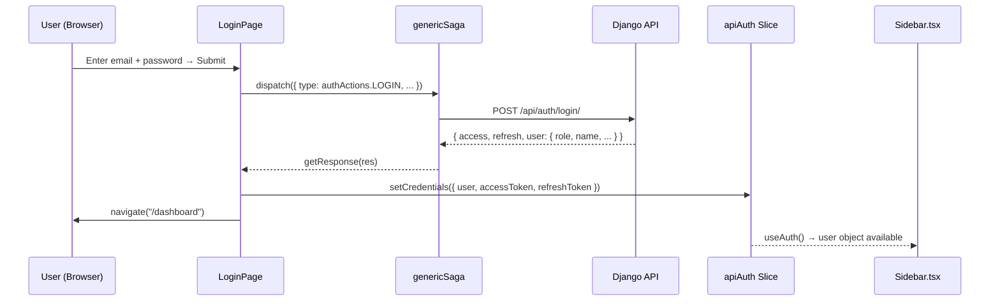
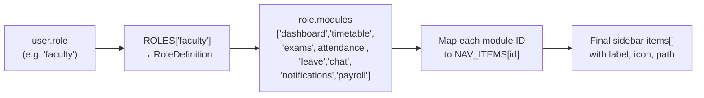
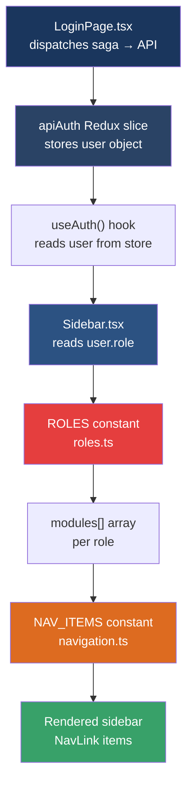

# Role-Based Sidebar Rendering — Full Flow

## 1. Login → User Object into Redux



### Step-by-step

| # | What happens | File |
|---|---|---|
| 1 | User fills email/password and clicks **Sign in** | [LoginPage.tsx](file:///c:/JMS%20-%20Developement/Insight%20ERP/insighterp/src/pages/auth/LoginPage.tsx#L136-L161) |
| 2 | `onSubmit` dispatches a saga action `authActions.LOGIN` with method `POST` to `/api/auth/login/` | [LoginPage.tsx:L137-L160](file:///c:/JMS%20-%20Developement/Insight%20ERP/insighterp/src/pages/auth/LoginPage.tsx#L137-L160) |
| 3 | The generic saga intercepts, makes the API call, and calls `getResponse(res)` on success | [genericSaga.ts](file:///c:/JMS%20-%20Developement/Insight%20ERP/insighterp/src/saga/createGenericSaga/genericSaga.ts) |
| 4 | Inside `getResponse`, the full response is saved to `localStorage` as `Insight_Login_Data`, then `setCredentials` is dispatched | [LoginPage.tsx:L146-L152](file:///c:/JMS%20-%20Developement/Insight%20ERP/insighterp/src/pages/auth/LoginPage.tsx#L146-L152) |
| 5 | The `apiAuth` Redux slice stores `user`, `accessToken`, `refreshToken` | [authSlice.ts](file:///c:/JMS%20-%20Developement/Insight%20ERP/insighterp/src/redux/slices/authSlice.ts#L16-L28) |
| 6 | `navigate("/dashboard")` takes the user to the dashboard, and the `Sidebar` mounts | — |

### The `user` object shape (from API)

```typescript
// types/api.auth.types.ts → AuthUser
{
  id: string;
  username: string;
  email: string;
  phone: string;
  name: string;
  role: string;         // ← THIS drives everything (e.g. "super_admin", "student")
  linked_student: null | string;
}
```

> [!IMPORTANT]
> The **`user.role`** field (a string like `"super_admin"`, `"faculty"`, `"student"`) is the single key that determines which sidebar tabs appear.

---

## 2. Sidebar Tab Resolution — The Core Logic

The magic happens on **one line** in [Sidebar.tsx:L62](file:///c:/JMS%20-%20Developement/Insight%20ERP/insighterp/src/components/layout/Sidebar.tsx#L61-L62):

```typescript
const role = user ? ROLES[user.role] : null;
const items = role?.modules.map((m) => ({ id: m, ...NAV_ITEMS[m] })) ?? [];
```

### How it works:



1. **`ROLES[user.role]`** — Looks up the role definition from [roles.ts](file:///c:/JMS%20-%20Developement/Insight%20ERP/insighterp/src/constants/roles.ts), which contains a `modules: ModuleId[]` array
2. **`role.modules.map(m => NAV_ITEMS[m])`** — For each module ID, fetches the `{ label, icon, path }` from [navigation.ts](file:///c:/JMS%20-%20Developement/Insight%20ERP/insighterp/src/constants/navigation.ts)
3. The resulting `items[]` array is what gets rendered as `<NavLink>` elements

---

## 3. Which User Sees Which Tabs

Below is the **complete role → tabs mapping** from [roles.ts](file:///c:/JMS%20-%20Developement/Insight%20ERP/insighterp/src/constants/roles.ts):

### ⭐ Super Admin
| Tab | Module ID |
|-----|-----------|
| Dashboard | `dashboard` |
| CRM & Admissions | `crm` |
| Students | `students` |
| Timetable | `timetable` |
| Attendance | `attendance` |
| Fees | `fees` |
| Exams | `exams` |
| Exam Supervision | `exam_supervision` |
| Faculty & Payroll | `faculty` |
| Leave Management | `leave` |
| Messages | `chat` |
| Notifications | `notifications` |
| Audit Logs | `audit_logs` |
| Reports | `reports` |
| My Payroll | `payroll` |

> **15 tabs** — full access to everything. Can delete & export.

---

### 🟣 Branch Manager
| Dashboard | CRM & Admissions | Students | Timetable | Attendance | Fees | Exams | Leave Management | Messages | Notifications | Audit Logs | Reports |
|:-:|:-:|:-:|:-:|:-:|:-:|:-:|:-:|:-:|:-:|:-:|:-:|
| ✅ | ✅ | ✅ | ✅ | ✅ | ✅ | ✅ | ✅ | ✅ | ✅ | ✅ | ✅ |

> **12 tabs** — No Exam Supervision, Faculty & Payroll, or My Payroll. Can export, cannot delete.

---

### 🔵 Admin Senior Executive
| Dashboard | CRM & Admissions | Students | Timetable | Attendance | Fees | Exams | Leave Management | Messages | Notifications | Reports |
|:-:|:-:|:-:|:-:|:-:|:-:|:-:|:-:|:-:|:-:|:-:|
| ✅ | ✅ | ✅ | ✅ | ✅ | ✅ | ✅ | ✅ | ✅ | ✅ | ✅ |

> **11 tabs** — No Exam Supervision, Faculty & Payroll, Audit Logs, or My Payroll.

---

### 🩵 Admin Executive
| Dashboard | Students | Attendance | Timetable |
|:-:|:-:|:-:|:-:|
| ✅ | ✅ | ✅ | ✅ |

> **4 tabs** — Minimal data-entry scope. No delete, no export.

---

### 🟢 Front Desk
| Dashboard | CRM & Admissions |
|:-:|:-:|
| ✅ | ✅ |

> **2 tabs** — Reception/inquiry intake only.

---

### 🔹 Counsellor
| Dashboard | CRM & Admissions |
|:-:|:-:|
| ✅ | ✅ |

> **2 tabs** — Same as Front Desk, manages assigned leads.

---

### 🟤 Tele Caller
| Dashboard | CRM & Admissions |
|:-:|:-:|
| ✅ | ✅ |

> **2 tabs** — Outreach and lead contact.

---

### 🟣 Sales Senior Executive
| Dashboard | CRM & Admissions | Reports |
|:-:|:-:|:-:|
| ✅ | ✅ | ✅ |

> **3 tabs** — CRM pipeline + reports. Can export.

---

### 💜 Sales Executive
| Dashboard | CRM & Admissions |
|:-:|:-:|
| ✅ | ✅ |

> **2 tabs** — Lead assignment only.

---

### 🟩 Student
| Dashboard | Attendance | Timetable | Exams | Fees | Messages | Notifications |
|:-:|:-:|:-:|:-:|:-:|:-:|:-:|
| ✅ | ✅ | ✅ | ✅ | ✅ | ✅ | ✅ |

> **7 tabs** — Academic + communication modules.

---

### 🌿 Parents
| Dashboard | Attendance | Fees | Exams | Messages | Notifications |
|:-:|:-:|:-:|:-:|:-:|:-:|
| ✅ | ✅ | ✅ | ✅ | ✅ | ✅ |

> **6 tabs** — Like Student but without Timetable.

---

### 🟡 Faculty
| Dashboard | Timetable | Exams | Attendance | Leave Management | Messages | Notifications | My Payroll |
|:-:|:-:|:-:|:-:|:-:|:-:|:-:|:-:|
| ✅ | ✅ | ✅ | ✅ | ✅ | ✅ | ✅ | ✅ |

> **8 tabs** — Teaching + personal payroll access.

---

### 🟠 Exam Supervisor
| Dashboard | Exam Supervision | Notifications | My Payroll |
|:-:|:-:|:-:|:-:|
| ✅ | ✅ | ✅ | ✅ |

> **4 tabs** — On-ground exam operations only.

---

### 🟡 Paper Checker
| Dashboard | Exams | Notifications | My Payroll |
|:-:|:-:|:-:|:-:|
| ✅ | ✅ | ✅ | ✅ |

> **4 tabs** — Evaluation-only role.

---

### 🍀 Accountant
| Dashboard | Fees | My Payroll | Reports | Notifications |
|:-:|:-:|:-:|:-:|:-:|
| ✅ | ✅ | ✅ | ✅ | ✅ |

> **5 tabs** — Finance and billing. Can export.

---

## 4. File Architecture Summary



| File | Purpose |
|------|---------|
| [LoginPage.tsx](file:///c:/JMS%20-%20Developement/Insight%20ERP/insighterp/src/pages/auth/LoginPage.tsx) | Captures credentials, hits API, stores response in Redux |
| [authSlice.ts](file:///c:/JMS%20-%20Developement/Insight%20ERP/insighterp/src/redux/slices/authSlice.ts) | Redux slice holding `user`, `accessToken`, `refreshToken` |
| [authSelectors.ts](file:///c:/JMS%20-%20Developement/Insight%20ERP/insighterp/src/store/selectors/authSelectors.ts) | Selectors for `user`, `isAuthenticated`, `loading`, `error` |
| [useAuth.ts](file:///c:/JMS%20-%20Developement/Insight%20ERP/insighterp/src/hooks/useAuth.ts) | Custom hook wrapping the selectors + logout dispatch |
| [role.types.ts](file:///c:/JMS%20-%20Developement/Insight%20ERP/insighterp/src/types/role.types.ts) | TypeScript types: `RoleId`, `ModuleId`, `RoleDefinition` |
| [roles.ts](file:///c:/JMS%20-%20Developement/Insight%20ERP/insighterp/src/constants/roles.ts) | **15 role definitions** each with a `modules[]` array |
| [navigation.ts](file:///c:/JMS%20-%20Developement/Insight%20ERP/insighterp/src/constants/navigation.ts) | Maps each `ModuleId` → `{ label, icon, path }` |
| [Sidebar.tsx](file:///c:/JMS%20-%20Developement/Insight%20ERP/insighterp/src/components/layout/Sidebar.tsx) | Reads `user.role`, resolves modules → nav items, renders |

> [!NOTE]
> There is also a **legacy** `store/slices/authSlice.ts` with `DUMMY_USERS` + `createAsyncThunk` login, but the **live login flow** uses the `redux/slices/authSlice.ts` (`apiAuth`) slice via the saga system. The `useAuth` hook reads from `state.apiAuth`.
